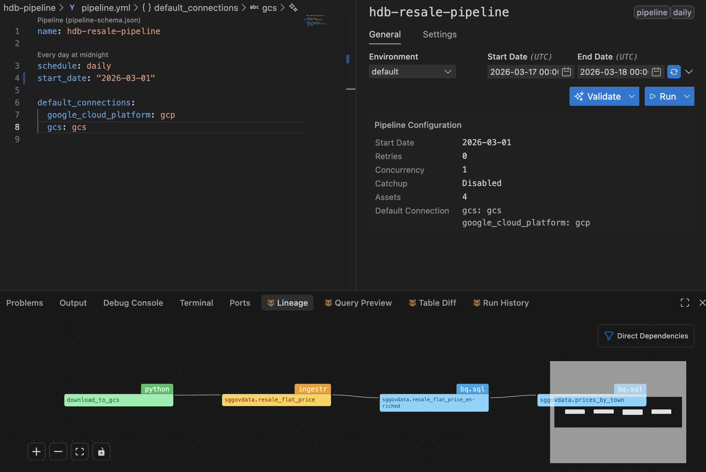

# HDB Resale Price Pipeline

A [Bruin](https://bruin-data.github.io/bruin/) data pipeline that ingests Singapore HDB resale flat transaction data from [data.gov.sg](https://data.gov.sg) into Google BigQuery.

## Pipeline Overview

```
data.gov.sg API → GCS → BigQuery (raw) → enriched view → aggregated view
```

| Asset | Type | Description |
|---|---|---|
| `download_to_gcs` | Python | Downloads CSV from data.gov.sg, uploads to GCS |
| `sggovdata.resale_flat_price` | Ingestr | Loads CSV from GCS into BigQuery |
| `sggovdata.resale_flat_price_enriched` | View | Adds parsed date, year, month, price_per_sqm |
| `sggovdata.prices_by_town` | View | Averages grouped by town, flat type, flat model |

---

## Setup

### 1. Install Bruin CLI

```bash
curl -LsSf https://raw.githubusercontent.com/bruin-data/bruin/main/install.sh | sh
```

Verify:
```bash
bruin --version
```

### 2. Install Bruin VS Code Extension (optional)

1. Open VS Code → Extensions (`Cmd+Shift+X`)
2. Search for **Bruin**
3. Click Install

The extension provides asset previews, lineage graphs, and inline run buttons.



### 3. Configure Connections

Copy the template and fill in your credentials:

```bash
cp .bruin.yml.example .bruin.yml   # if example exists, otherwise create it
```

`.bruin.yml` structure:

```yaml
default_environment: default
environments:
  default:
    connections:
      google_cloud_platform:
        - name: gcp
          project_id: <your-gcp-project-id>
          location: asia-southeast1
          use_application_default_credentials: true
      gcs:
        - name: gcs
          bucket_name: <your-gcs-bucket>
          service_account_file: /path/to/service-account.json
```

> `.bruin.yml` is gitignored — never commit credentials.

### 4. Set up Google Cloud credentials

```bash
# For BigQuery (ADC)
gcloud auth application-default login

# Verify access
bq ls --project_id=<your-project-id>
```

For GCS, provide a service account JSON key file with `roles/storage.objectViewer` on the bucket.

### 5. Set up environment variables

Create a `.env` file at the project root:

```bash
DATAGOVSG_API_KEY=your_api_key_here
```

Get your API key from [https://data.gov.sg](https://data.gov.sg) → Account → API Keys.

---

## Running the Pipeline

### Validate

Check that all assets and connections are correctly configured:

```bash
bruin validate hdb-pipeline/
```

### Run the full pipeline

```bash
bruin run hdb-pipeline/
```

### Run a single asset

```bash
bruin run hdb-pipeline/assets/download_to_gcs.py
bruin run hdb-pipeline/assets/resale_flat_price.asset.yml
bruin run hdb-pipeline/assets/resale_flat_price_enriched.sql
bruin run hdb-pipeline/assets/prices_by_town.sql
```

### Run with full refresh (replaces table)

```bash
bruin run hdb-pipeline/assets/resale_flat_price.asset.yml --full-refresh
```

### Run only quality checks

```bash
bruin run hdb-pipeline/ --only checks
```

---

## Initialising a new Bruin project from scratch

```bash
# Create a new pipeline project
bruin init my-pipeline

# Navigate into it
cd my-pipeline

# Edit .bruin.yml to add your connections, then validate
bruin validate my-pipeline/
```

The `init` command scaffolds the directory structure:
```
my-pipeline/
├── .bruin.yml          # connections config (gitignore this)
└── my-pipeline/
    ├── pipeline.yml    # pipeline definition
    └── assets/         # put your SQL/Python assets here
```
